# MCA Prosecutor

### 极高的效率，极强的兼容，极致的优化

MCA Prosecutor 是一款 Minecraft 存档处理工具，支持 1.2.1 ~ 26.1.2+ 几乎所有版本的 Minecraft

它可以删除和替换存档中指定的物品和方块，并且完全独立于 Minecraft，无需加载区块甚至无需启动 Minecraft

通过直接读取和编辑存档文件的方式，可以确保不会漏掉整个世界中任意一个已经存在的物品和方块！

此外存档清理功能也是一大亮点，通过删除不活跃的区块来大大缩小存档体积，帮您节省宝贵的磁盘空间。

> [!IMPORTANT]
> **本项目由ZZYDD开发维护，使用GPL3.0协议，请遵守开源协议！**

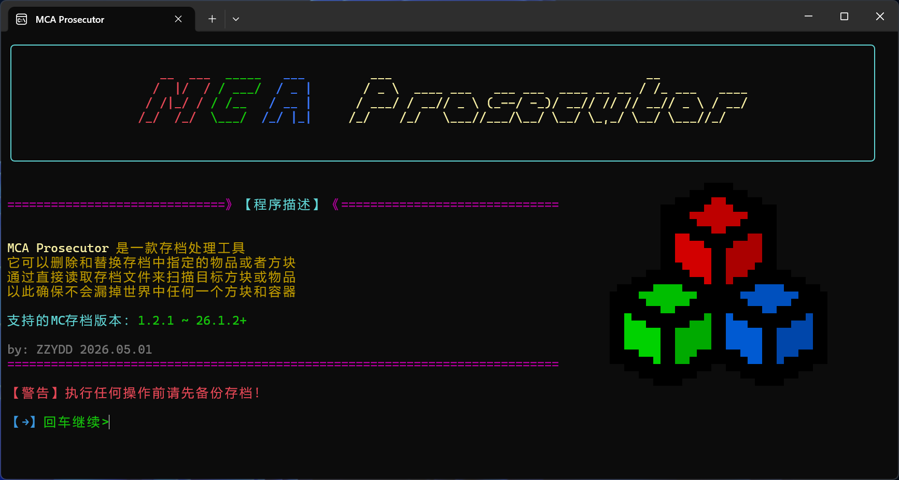

> [!CAUTION]
> **进行任何操作前，请先 备份存档！备份存档！备份存档！**

> [!WARNING]
> **若使用本程序导致存档异常，欢迎反馈问题；但是！我不会对您的损失负责！**
>
> **最终发布的版本在多个版本多个端的 Minecraft 版本下均运行正常，没有导致存档损坏或异常。**
>
> **但是仍可能存在一些未被发现的BUG，所以为了以防万一，还是请您在进行任何操作前备份您的存档！**
>
> **作为项目作者，对本项目负责是我的义务，遇到程序上的问题您可以反馈。**
>
> **但您的存档需要您自己负责，我没有义务来为您的存档负责。所以，请做好备份！避免不必要的损失！**

# 目录

### [一：功能特色](#一功能特色-1)

- #### [1.1：极强的兼容](#1️⃣-跨平台和兼容性)
- #### [1.2：极高的效率](#2️⃣-极致的性能和优化)
- #### [1.3：极致的优化](#3️⃣-解放您的磁盘)

### [二：使用说明](#二使用说明-1)

- #### [2.1：替换方块](#1️⃣-替换方块)
- #### [2.2：替换物品](#2️⃣-替换物品)
- #### [2.3：存档清理](#3️⃣-存档清理)
- #### [2.4：配置文件](#4️⃣-配置文件)

### [三：兼容性](#三兼容性)

- #### [3.1：功能兼容性](#三兼容性-1)
- #### [3.2：兼容测试报告](#功能兼容性测试报告)

### [四：环境部署](#四环境部署)
- #### [4.1：环境部署](#四环境部署)

### [五：感谢与尾声](#五感谢与尾声)
- #### [5.1：许可证](#许可证)
- #### [5.2：版权信息](#本项目版权声明)

# 一：功能特色

## 1️⃣ 跨平台和兼容性

* 支持 Windows, Linux, MacOS。纯python开发，跨平台支持！
* 支持 1.2.1 ~ 26.1.2 近15年来几乎所有版本的 Minecraft 版本！
* 支持 Forge, Fabric, Bukkit, Spigot, Paper... 理论上不受服务端约束!
* 支持 任意模组！从底层数据格式入手，理论上所有模组中的物品和容器都完美兼容！
* 支持 任意世界高度！无论是 0-64 还是 -64-320，甚至超过 -64 和 320 的自定义世界，全部支持！

> [!NOTE]
> 超过 -64 和 320 的世界需要调整配置文件中的高级设置选项

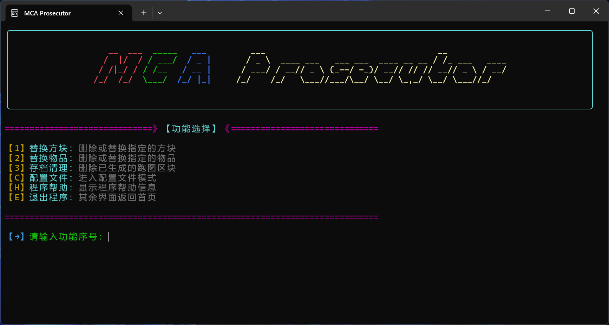

## 2️⃣ 极致的性能和优化

* 多进程并发处理，充分利用CPU性能
* 极低的内存占用，对低内存设备友好
* 极快的处理速度，100GB存档处理耗时约30分钟
* 在内存中流式处理，最大限度减少磁盘读写，对磁盘友好
* 智能先扫描后处理，最大限度减少无效计算，不做无用功

> [!TIP]
> 可以在替换物品和方块前先运行一次清理存档，减小存档体积后可大幅缩短处理时间

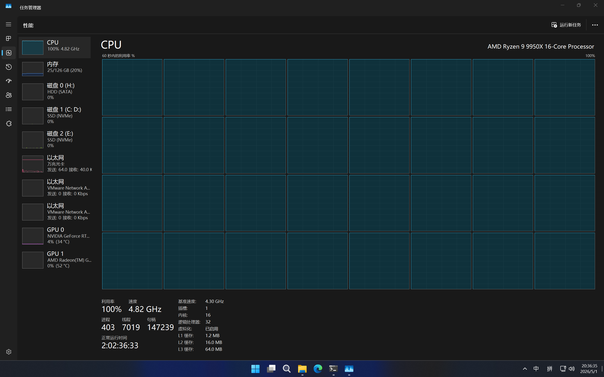

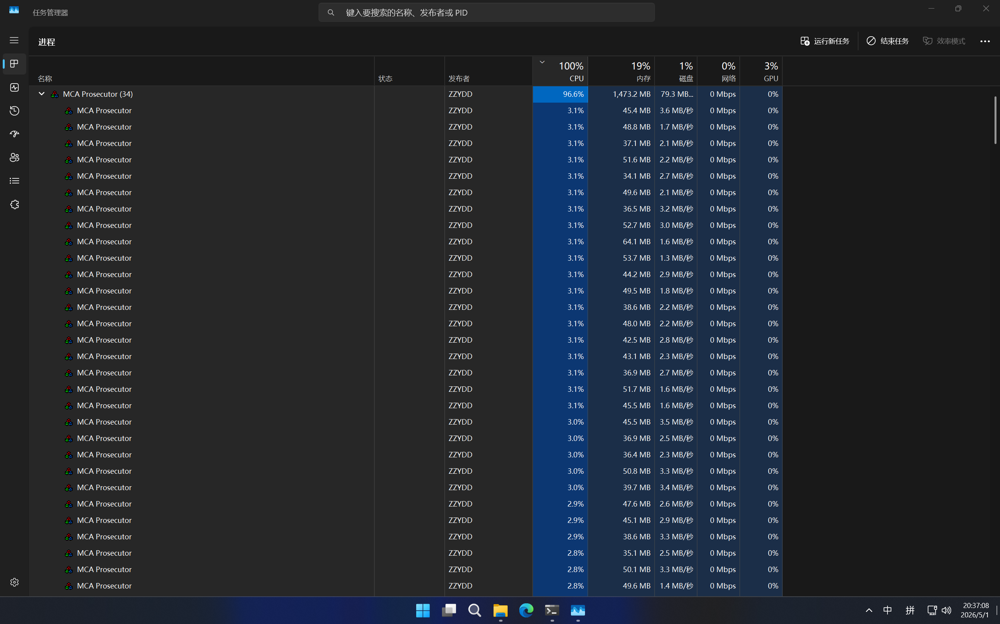

* 测试截图

> 测试存档40GB; 替换所有石头和泥土; CPU使用9950X; 32进程处理耗时 1041秒 (17.35分钟)
>
> 测试为极端情况，具体处理时间会因存档和CPU不同，以及替换目标的数量不同而有所变化，请以实际为准

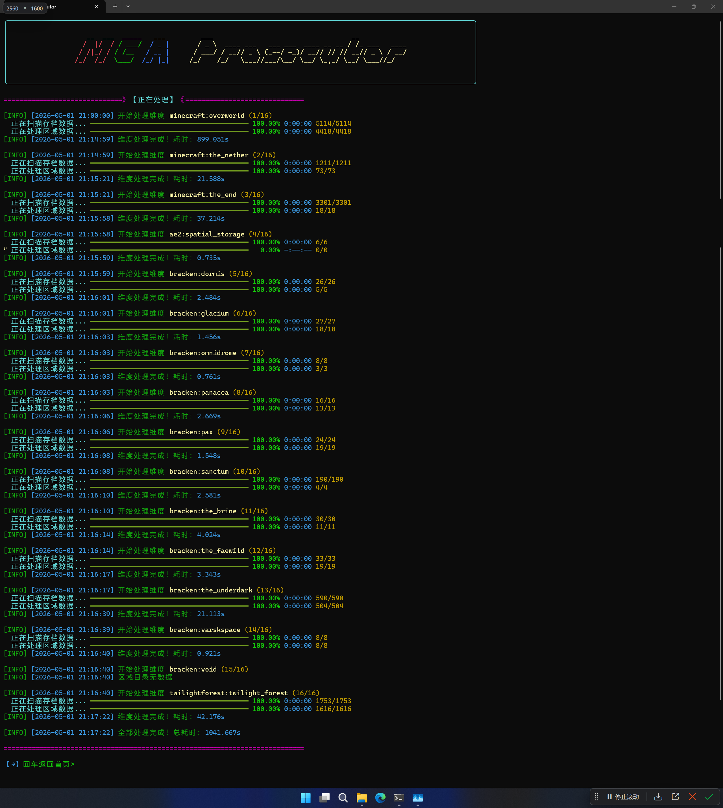

## 3️⃣ 解放您的磁盘

* 通过删除不活跃的区块，如跑图和探索时路过的区块，从而大大减小存档体积
* 这些区块通常只是因为路过而生成，后续不再有玩家活动，且大多服务器中都是这种区块
* 删除这些区块对实际体验几乎没有任何影响，但能极大地减少磁盘占用，所以，何乐而不为？

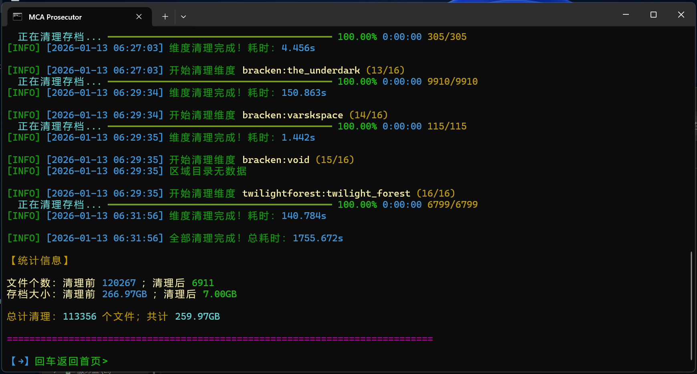

# 二：使用说明

> [!CAUTION]
> **进行任何操作前，请先 备份存档！备份存档！备份存档！**

> [!WARNING]
> **若使用本程序导致存档异常，欢迎反馈问题；但是！我不会对您的损失负责！**
>
> **最终发布的版本在多个版本多个端的 Minecraft 版本下均运行正常，没有导致存档损坏或异常。**
>
> **但是仍可能存在一些未被发现的BUG，所以为了以防万一，还是请您在进行任何操作前备份您的存档！**
>
> **作为项目作者，对本项目负责是我的义务，遇到程序上的问题您可以反馈。**
>
> **但您的存档需要您自己负责，我没有义务来为您的存档负责。所以，请做好备份！避免不必要的损失！**

> [!NOTE]
> **只能替换已经生成并存在的区域，无法替换未生成或未完全生成的区域！**

## 1️⃣ 替换方块

### 作用：将世界中已经存在的一种方块替换为另外一种方块或删除。

#### 1. 输入功能序号 `1` 并回车

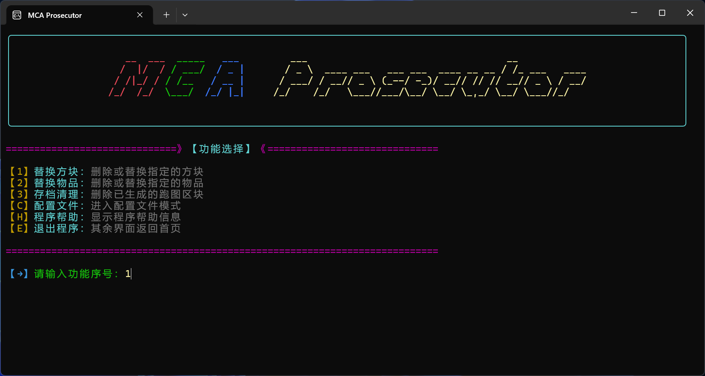

#### 2. 输入存档根目录路径

> [!TIP]
> 支持绝对路径和相对路径
>
> 但建议使用绝对路径，且非常不建议使用相对路径

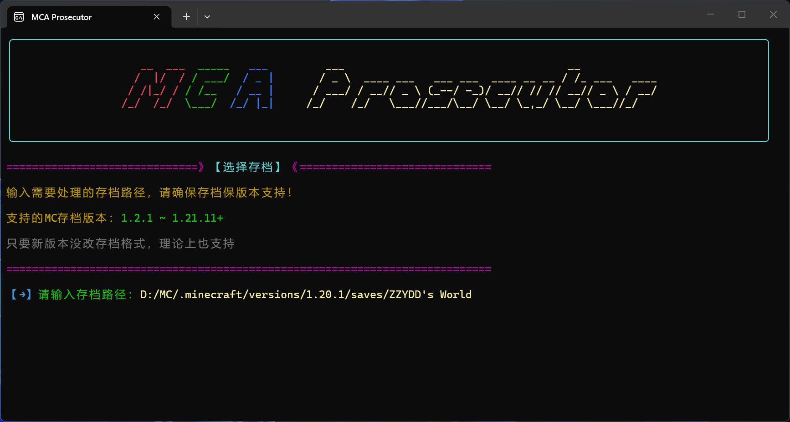

#### 3. 选择需要处理的维度

* 若只需要处理一个维度，那输入对应的序号即可，如 `1`
* 若需要处理所有维度，可直接输入 `A`
* 若需要处理指定的几个维度，输入序号后用 `,` 分割，如 `1, 3`

> [!NOTE]
> 所有符号必须使用英文符号

> [!TIP]
> 所有字母输入无需区分大小写
>
> 空格不影响解析，程序会自动忽略

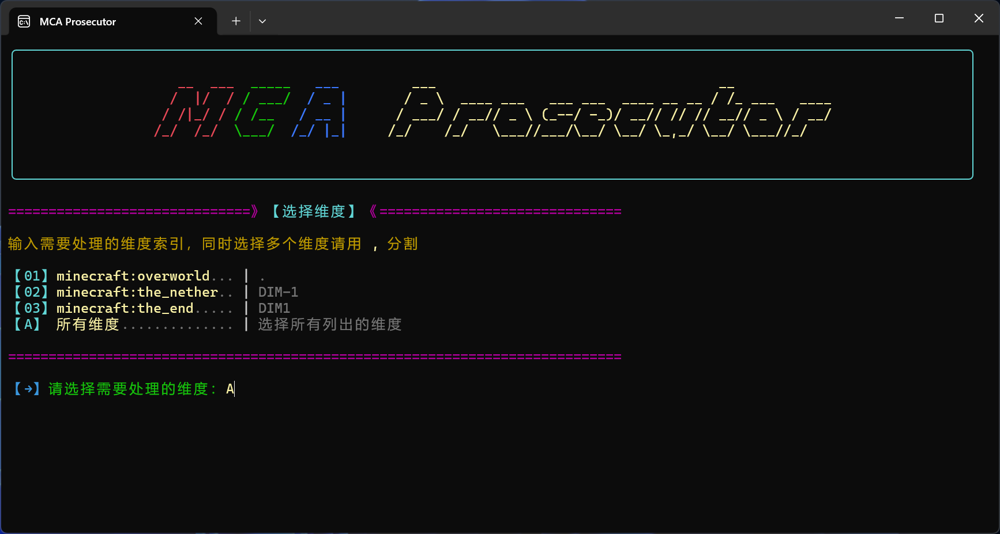

#### 4. 输入要处理的坐标

* 若处理整个地图，则输入 `all` 或 `A`

> [!NOTE]
> 输入的坐标是方块坐标，但程序会进行区域文件对齐，所以实际处理区域可能会大于选定的区域

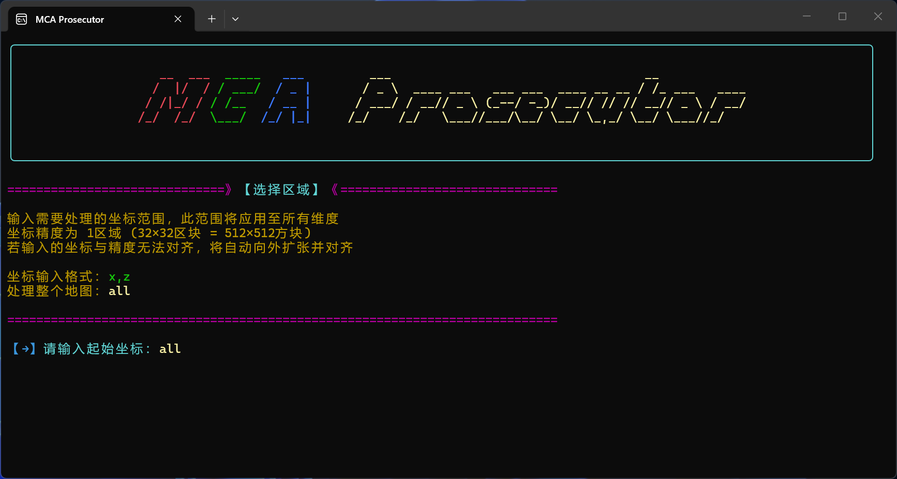

#### 5. 输入替换目标

* 目标设置格式：

  `被替换的方块注册名 > 用于替换的新方块注册名`
* 支持同时设置多个目标，用 `;` 分隔。如：

  `被替换的方块1注册名 > 用于替换方块1的新方块2注册名 ; 被替换的方块3注册名 > 用于替换方块3的新方块4注册名`
* 若要删除方块则将新方块注册名设置为

  `minecraft:air`
* 举例：删除所有石头

  `minecraft:stone > minecraft:air`
* 举例：将所有石头替换成金块

  `minecraft:stone > minecraft:gold_block`
* 举例：删除所有草方块，并将所有石头替换成金块

  `minecraft:grass_block > minecraft:air ; minecraft:stone > minecraft:gold_block`

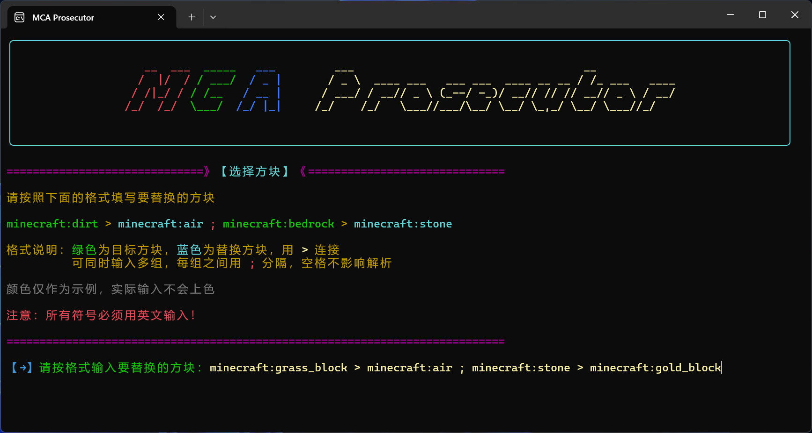

#### 6. 设置处理进程数量

* 数量越多处理速度越快。1进程速度是×1，4进程速度就是×4
* 进程数量需小于等于系统的逻辑处理器数量 (你CPU有多少线程，最多就能设多少)

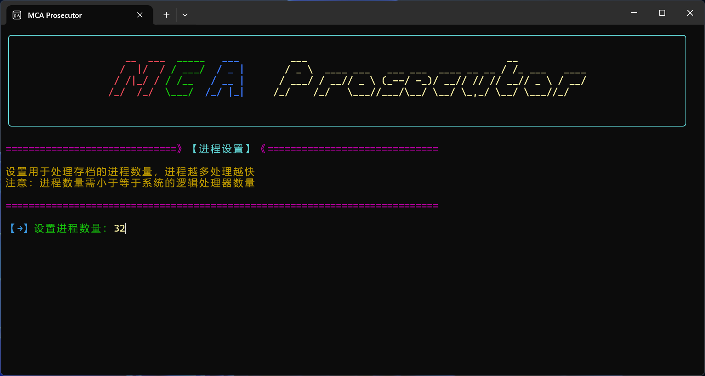

#### 7. 确认参数

* 确认无误后输入 `Y` 并按回车进行确认

> [!WARNING]
> **确认后执行的所有操作均不可撤销！为确保安全，请先备份存档！**
>
> **若此时取消，则不会发生任何事情，这是最后的机会。**

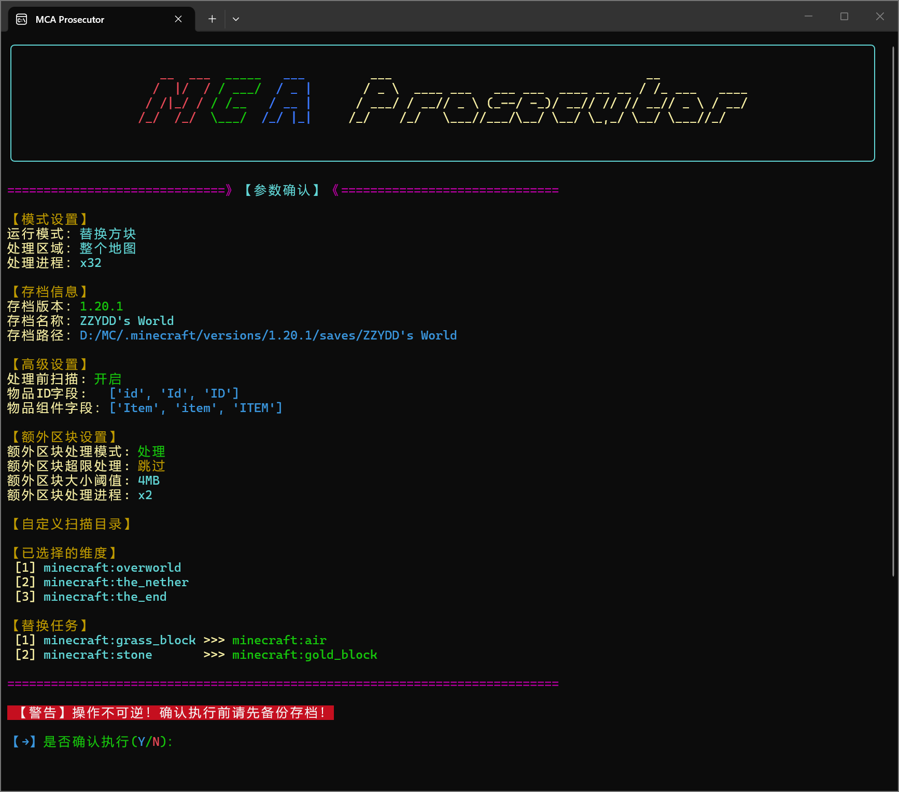

#### 8. 等待程序处理

* 处理完成后按回车 即可返回主页面

> [!WARNING]
> **处理过程中请勿关闭或终止程序！这可能导致存档异常或损坏！**

> [!IMPORTANT]
> 我不建议尝试去删除世界中所有石头之类的基础方块😁
>
> 因为这样会产生很多浮空的沙子和沙砾，尤其是在海底🤭
>
> 而这些方块一旦更新，就会引发链式反应并瞬间产生大量掉落物🤫
>
> 如果真的好奇想试记得提前写好清掉落物的命令方块，别问我怎么知道的😭

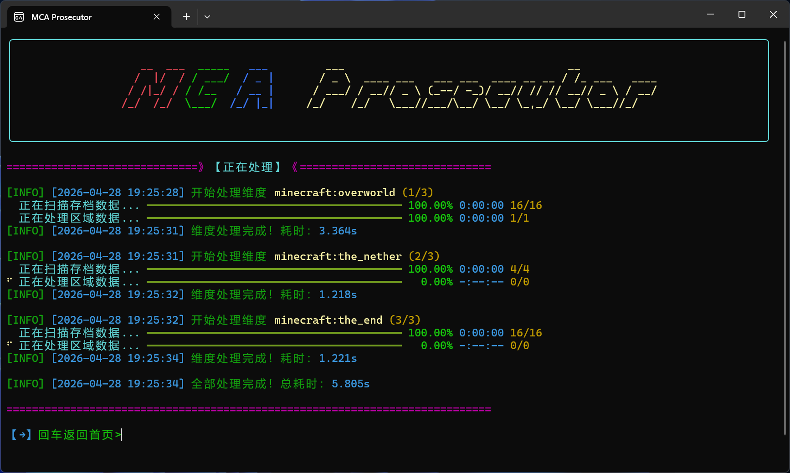

#### 9. 处理效果

* 处理前

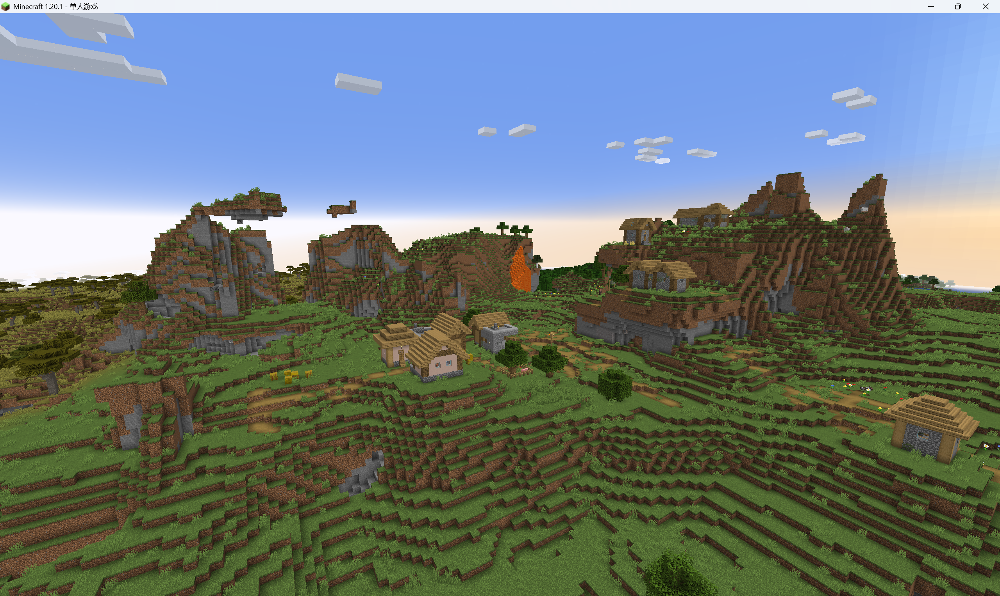

* 处理后


## 2️⃣ 替换物品

### 作用：将世界中已经存在的一种物品替换为另外一种物品或删除。

> [!NOTE]
> 支持嵌套容器的递归搜索和替换

#### 1. 输入功能序号 `2` 并回车


#### 2. 输入存档根目录路径

> 本步骤具体说明事项同 `替换方块`


#### 3. 选择需要处理的维度

> 本步骤具体说明事项同 `替换方块`


#### 4. 输入要处理的坐标

> 本步骤具体说明事项同 `替换方块`


#### 5. 输入替换目标

* 目标设置格式：

  `被替换的物品注册名 > 用于替换的新物品注册名`
* 支持同时设置多个目标，用 `;`分隔。如：

  `被替换的物品1注册名 > 用于替换物品1的新物品2注册名 ; 被替换的物品3注册名 > 用于替换物品3的新物品4注册名`
* 若要删除物品则将新物品注册名设置为

  `none`
* 举例：删除所有钻石

  `minecraft:diamond > none`
* 举例：将所有红石替换成苹果

  `minecraft:redstone > minecraft:apple`
* 举例：删除所有钻石，并将所有红石替换成苹果

  `minecraft:diamond > none ; minecraft:redstone > minecraft:apple`

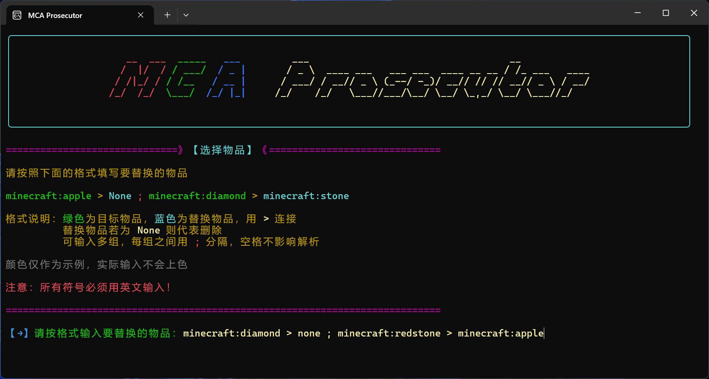

#### 6. 设置扫描模式

##### 普通扫描：扫描 实体+方块实体+玩家数据

* 扫描 `region 目录中的 .mca 文件`
* 扫描 `entities 目录中的 .mca 文件`
* 扫描 `playerdata 目录中的 .mca 文件`
* 扫描 `level.dat` (若存在玩家数据)

> [!TIP]
> 普通扫描仅适用于纯原版端

##### 全面扫描：扫描 实体+方块实体+玩家数据+数据文件

* 扫描 `data 目录中的 .dat 文件`
* 扫描 `region 目录中的 .mca 文件`
* 扫描 `entities 目录中的 .mca 文件`
* 扫描 `playerdata 目录中的 .mca 文件`
* 扫描 `level.dat` (若存在玩家数据)

> [!TIP]
> 全面扫描是推荐的选项，适用于原版端和模组端
>
> 但对于模组中的内容可能会有遗漏

##### 暴力扫描：在全面扫描的基础上不限文件类型且包括子目录

* 扫描 `data 目录及所有子目录中的所有文件`
* 扫描 `region 目录及所有子目录中的所有文件`
* 扫描 `entities 目录及所有子目录中的所有文件`
* 扫描 `playerdata 目录及所有子目录中的所有文件`
* 扫描 `level.dat` (若存在玩家数据)

> [!TIP]
> 全面扫描的加强版，极大减少了模组端出现遗漏的情况

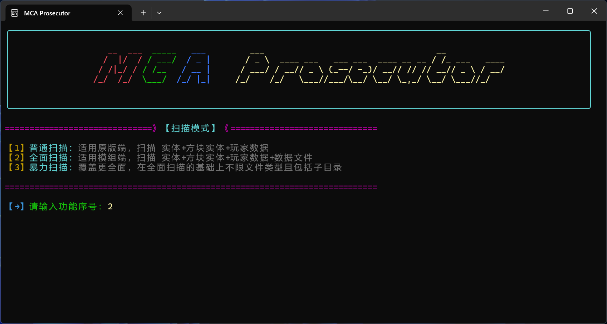

#### 7. 设置处理进程数量

> 本步骤具体说明事项同 `替换方块`


#### 8. 确认参数

* 确认无误后输入 `Y`并按回车进行确认

> [!WARNING]
> **确认后执行的所有操作均不可撤销！为确保安全，请先备份存档！**
>
> **若此时取消，则不会发生任何事情，这是最后的机会。**

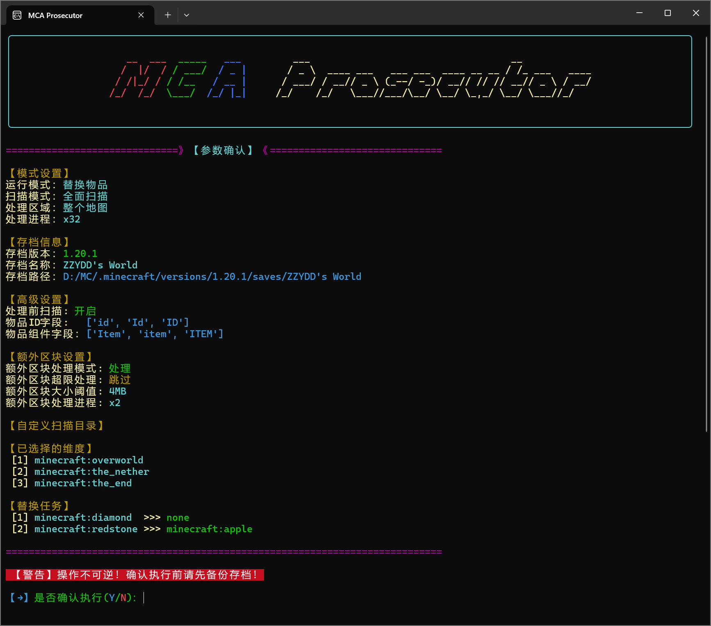

#### 9. 等待程序处理

* 处理完成后按回车 即可返回主页面

> [!WARNING]
> **处理过程中请勿关闭或终止程序！这可能导致存档异常或损坏！**

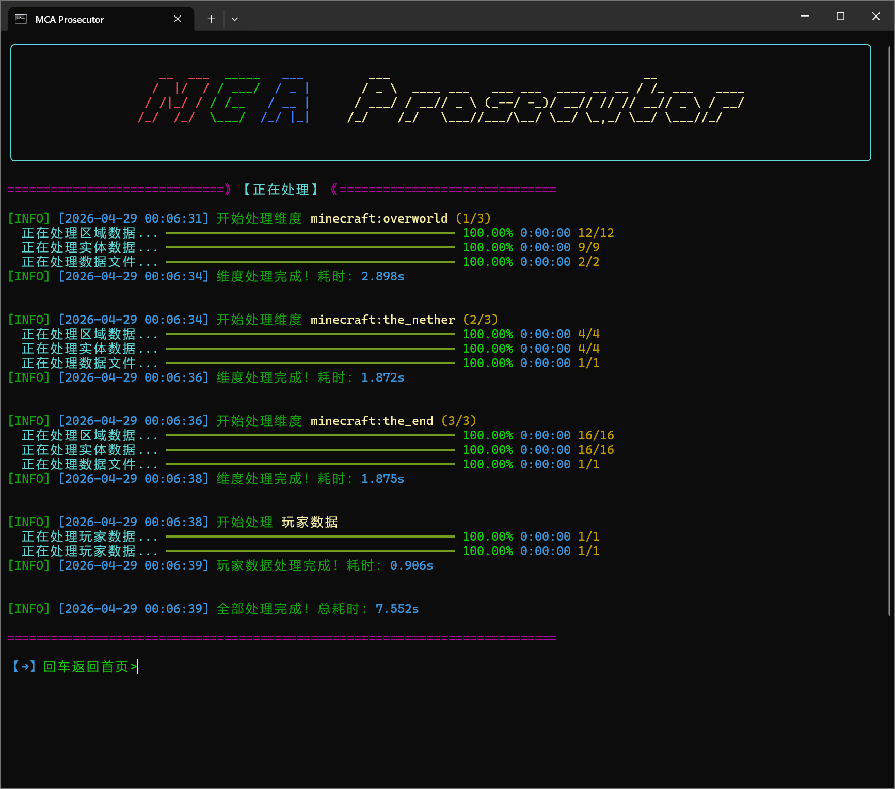

#### 10. 处理效果

* 处理前

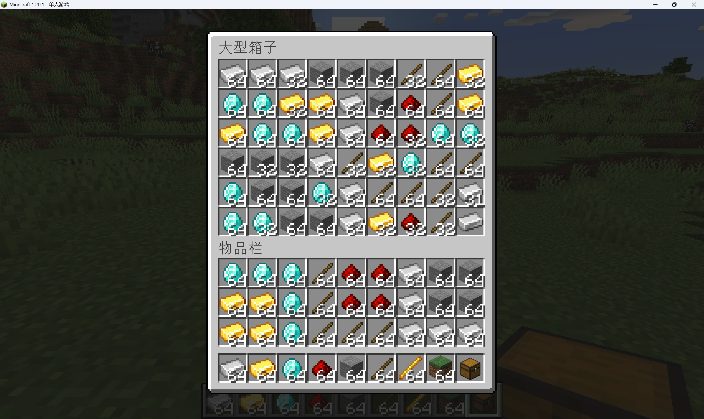

* 处理后

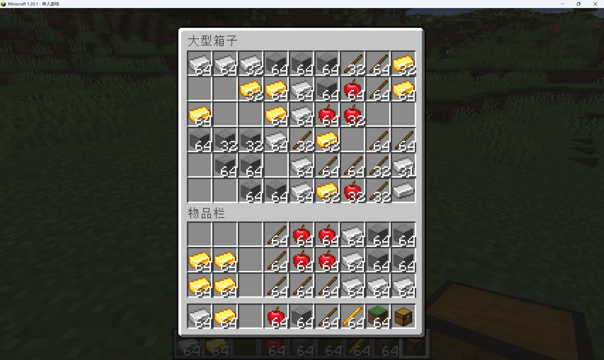

## 3️⃣ 存档清理

### 作用：删除那些已经生成，但是玩家活动不活跃的区块。如跑图时快速经过的区块

> [!IMPORTANT]
> 本功能仅支持 15w32a (1.9) 及之后的 Minecraft 版本

#### 1. 输入功能序号 `3` 并回车


#### 2. 输入存档根目录路径

> 本步骤具体说明事项同 `替换方块`

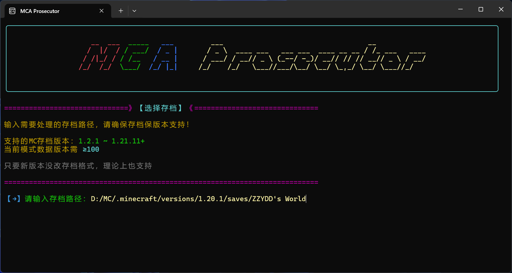

#### 3. 选择需要处理的维度

> 本步骤具体说明事项同 `替换方块`


#### 4. 输入要处理的坐标

> 本步骤具体说明事项同 `替换方块`


#### 5. 设置活跃时间识别阈值

* 区块活跃时间：所有玩家在此区块停留的总时间，以游戏刻计(tick)。如果有多个玩家在这个区块停留过则分别计时并相加。
* 若区块活跃时间未达到设置的阈值，则会被判定为不活跃的区块，将进入后续的清理判断流程。否则将视为活跃区块，跳过清理流程

> [!TIP]
> 越大越激进，越小越保守。建议值：600-1200

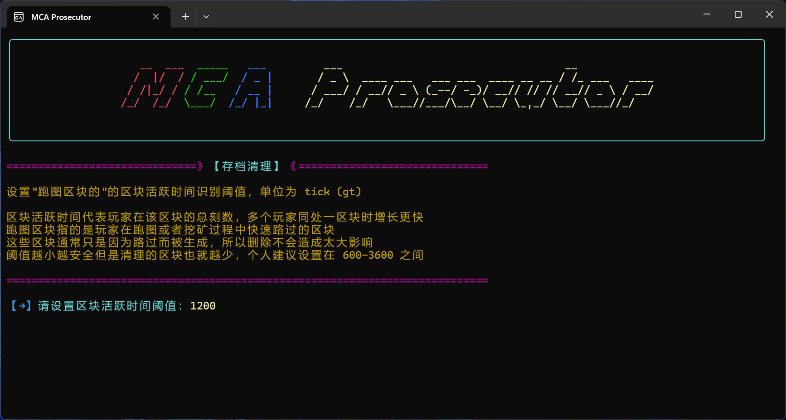

#### 6. 设置区块生成冷却时间

* 跳过刚刚生成的区块，以游戏刻计(tick)，生成时间小于此时间的区块将跳过清理流程。

> [!TIP]
> 越大越保守，越小越激进。建议值：6000-12000

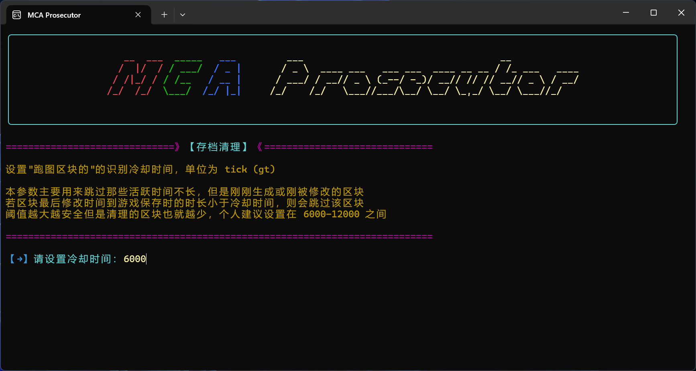

#### 7. 设置处理进程数量

> 本步骤具体说明事项同 `替换方块`


#### 8. 确认参数

* 确认无误后输入 `Y`并按回车进行确认

> [!WARNING]
> **确认后执行的所有操作均不可撤销！为确保安全，请先备份存档！**
>
> **若此时取消，则不会发生任何事情，这是最后的机会。**

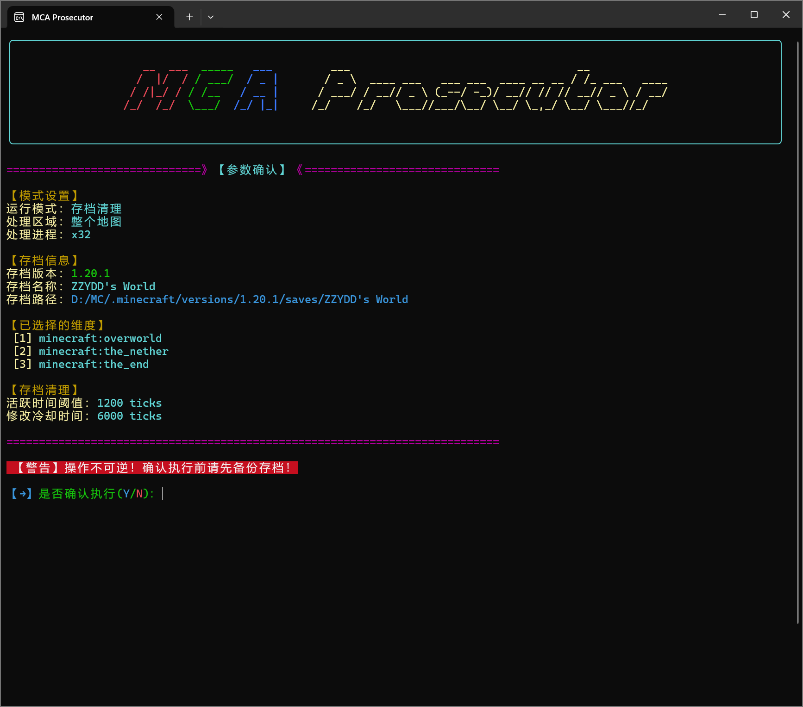

#### 9. 等待程序处理

* 处理完成后按回车 即可返回主页面

> [!WARNING]
> **处理过程中请勿关闭或终止程序！这可能导致存档异常或损坏！**

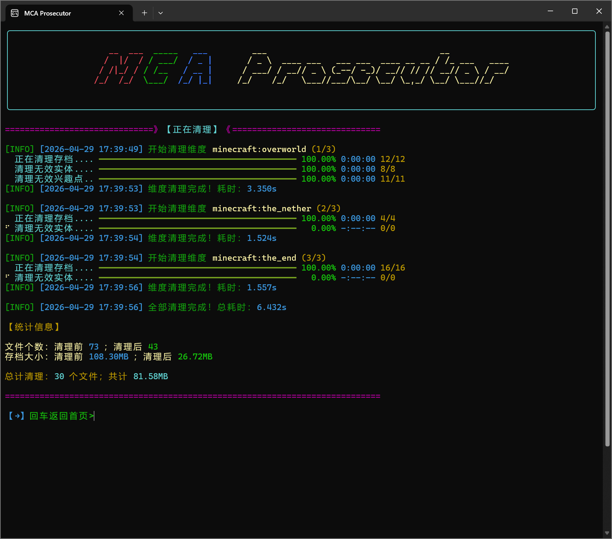

#### 10. 实际应用效果

* 这是我自己的一个服务器，总玩家数量300人左右，日活玩家5-10人，
* 开服近半年，数据量300GB，其中存档占了267GB

> 此次测试时本功能刚开发完毕，开始测试优化，与发行版可能略有不同

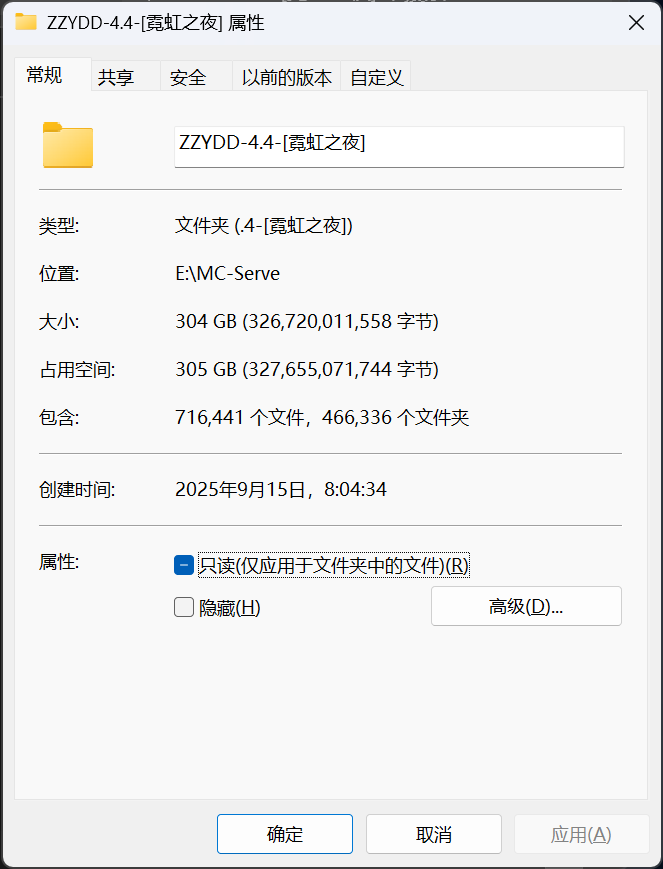

* 通过清理，把存档从 267GB 缩小到了 7GB，整整减小了 38倍，非常夸张


* 这主要是因为玩家活跃的区域其实都比较固定和集中
* 剩下绝大多数区域其实都是在跑图探索路过时生成的
* 地图中玩家跑图探索路过的区域被删除，留下的一个个"岛"就是玩家活跃的区域
* 服务器后续也一切正常，没有玩家来反应建筑丢失区块受损之类的问题

> 不同服务器存档不同玩家性质也不同，所以具体效果以实际为准

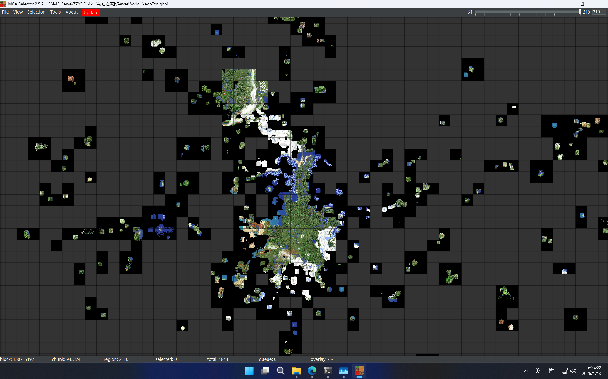

## 4️⃣ 配置文件

### 作用：配置文件可以设置并保存运行模式和参数，免去一步步输入和设置参数。同时提供一些高级设置选项

* 输入 `C` 即可进入配置文件模式

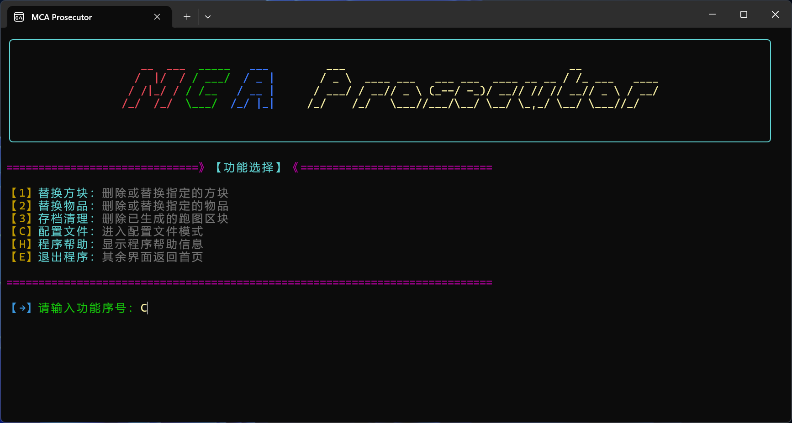

### 4.1 加载配置

* 在配置文件模式页面输入 `1`


* 输入配置文件路径即可

> [!NOTE]
> 配置文件不会自动创建
>
> 若无配置文件请先创建，详见 `4.2 创建配置`

> [!TIP]
> 支持绝对路径和相对路径
>
> 直接回车将尝试寻找当前目录下的配置文件

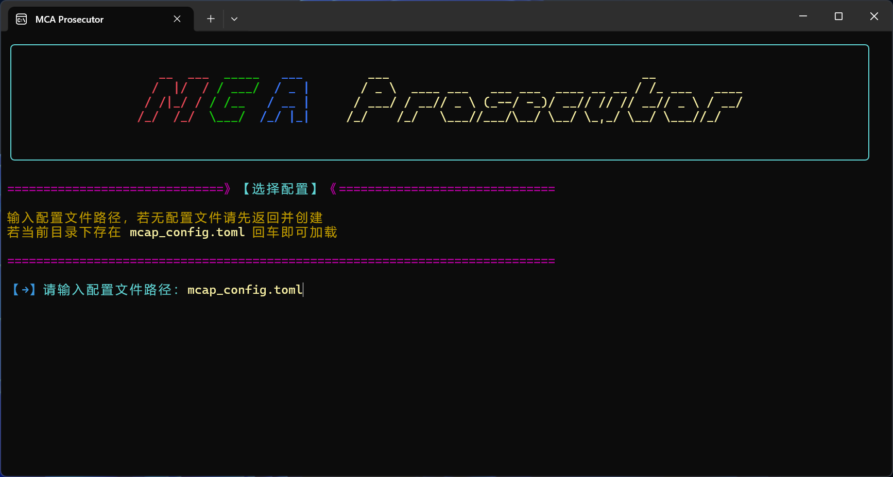

### 4.2 创建配置

* 在配置文件模式页面输入 `2` 即可创建
* 配置文件将创建为当前目录下的 `mcap_config.toml`

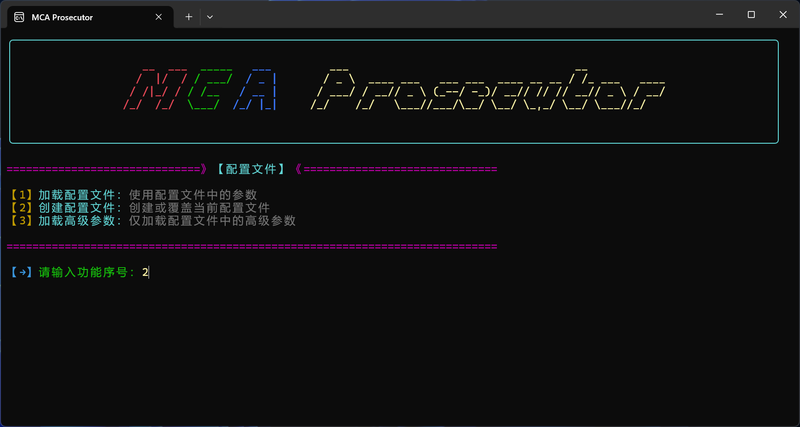

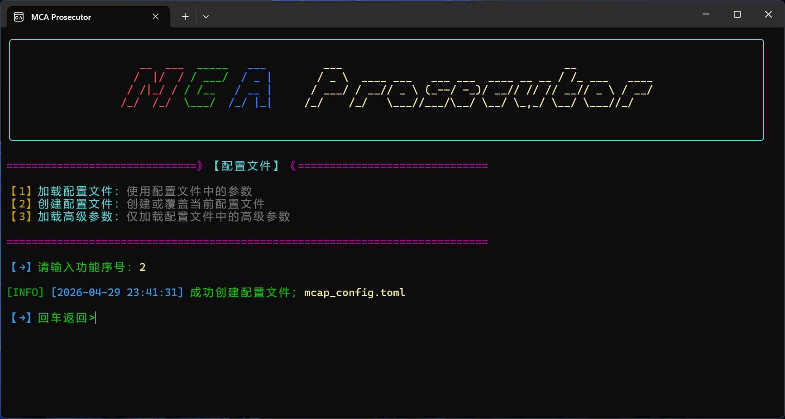

* 若当前目录下已经存在相同名称的配置文件，将提示是否覆盖
* 输入 `Y` 将覆盖当前配置文件，否则将取消创建

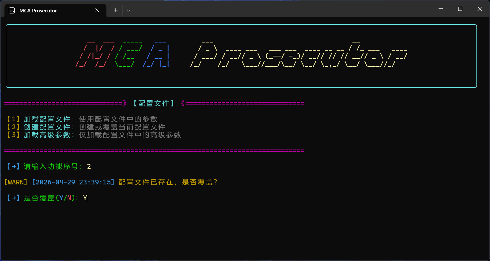

### 4.3 加载高级参数

* 如果你想使用常规的方式来设置参数，同时还需要设置高级参数的话，可以使用此模式
* 此模式只会加载配置文件中的高级参数，并在本次会话中全局生效。
*

> 重启程序后需加载的参数不会持续保存，需要重新加载


* 输入配置文件路径即可

> 本步骤具体说明事项同 `4.1 加载配置`


* 加载成功后会显示当前高级设置参数

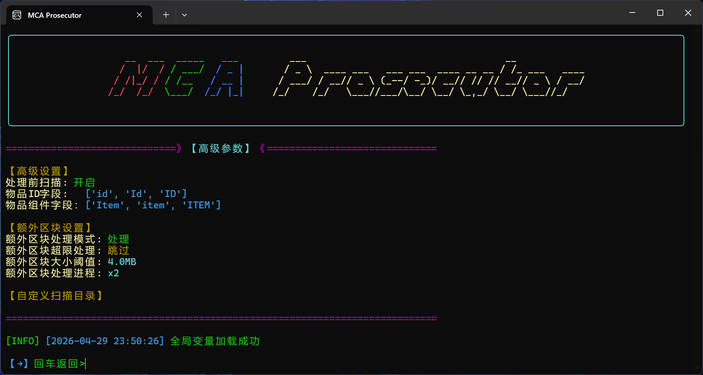

### 4.4 配置文件模板及说明

- [MCA Prosecutor 配置文件模板](./model/config/default_config.toml)

> [!NOTE]
> 下方配置模板仅供展示，版本可能滞后，最新配置模板请访问上方链接

```toml
[Mode]
# 设置运行模式
# "block": 删除或替换方块
# "item":  删除或替换物品
# "clean": 清理存档
Main_Mode = "block"
# 存档路径
# 你的存档根目录
Save_Path = "save/path"
# 物品扫描模式
# "common": 普通扫描，适用原版端，扫描 实体+地图+玩家数据 目录
# "full":   完整扫描，适用模组端，扫描 实体+地图+玩家数据+数据文件 目录
# "global": 全面扫描，适用模组端，扫描 实体+地图+玩家数据+数据文件 目录及子目录
# "custom": 自定义扫描，仅扫描高级设置custom_scan_path中的路径
Item_Scan_Mode = "common"
# 扫描进程数量
Process_Use = 4


[Target]
# 需要扫描并处理的维度
# 若要扫描所有维度请设置为 ["all"]
Dimensions = [ "minecraft:overworld", "minecraft:the_nether", "minecraft:the_end",]

[Target.Task]
# 目标任务
# 需要替换的方块或物品，把左边的替换成右边的
# 如需添加更多替换任务，在这一项底部接着写就行
"minecraft:dirt" = "minecraft:air"
"minecraft:stone" = "minecraft:bedrock"

[Target.Select_Area]
# 目标区域
# 需要处理的区域，同时适用所有维度，若都为 [0,0] 代表处理整个地图
# 范围是 从top_xz 到end_xz 的矩形区域。精度为32区块，不足32区块自动向外扩展
top_xz = [ 0, 0,]
end_xz = [ 0, 0,]


# 存档清理设置
[Target.Cleaner]
# "跑图区块的"的区块活跃时间识别阈值，单位为 tick (gt)
# 区块活跃时间代表玩家在该区块的总刻数，多个玩家同处一区块时增长更快
# 跑图区块指的是玩家在跑图或者挖矿过程中快速路过的区块
tick_threshold = 3600

# "跑图区块的"的识别冷却时间，单位为 tick (gt)
# 若区块最后修改时间到游戏保存时的时长小于冷却时间，则会跳过该区块
cooldown = 6000


[Advanced]
# 世界高度限制-最高高度
world_height_top = 320
# 世界高度限制-最高低度
world_height_end = -64

# 是否在执行处理前先进行扫描 (仅对block模式生效)
# 若目标不是常见方块(不是每个区块都有)，那建议开启，处理速度会明显提升
# 若目标是常见方块(每个区块都有)，那建议关闭，开启后处理速度反而会下降
scan_before_processing = true

# 自定义物品数据文件扫描目录 (仅对item模式生效)
# 添加后，程序将尝试解析目录下的所有文件，并扫描处理文件中物品数据
# 注意只适用于以NBT格式存储的文件，就像data和playerdata中的文件；不适用于.mca
custom_scan_path = []


[Advanced.mcc_file]
# 对于额外区块存储文件 .mcc 的处理方式
# 若区块内包含很多数据，处理将消耗大量内存和时间！请自行决定是否处理！
# skip: 跳过
# delete: 删除
# handle: 正常处理
mcc_file_mode = "handle"

# 用于处理.mcc文件的进程数量
# 处理.mcc文件可能会消耗大量内存，请自己抉择！
mcc_file_process_use = 2

# 处理.mcc文件的大小限制，超过此大小的文件将视为无效文件，单位MB
mcc_file_size_limit = 4

# 无效(超限)的.mcc文件处理模式
# skip: 跳过
# delete: 删除
# handle: 无视风险，继续处理
invalid_mcc_file_mode = "skip"


[Advanced.item_compound_key]
# 物品标签识别关键词
# 程序就是通过这些关键词从NBT数据中找出存储物品的字段
# 正常情况下无需修改，除非你知道这是什么意思并清楚你在做什么。具体请看下面的说明
id_keys = [ "id", "Id", "ID",]
item_keys = [ "Item", "item", "ITEM",]

# 物品标签识别关键词匹配格式说明：
# 程序在处理物品时，会尝试遍历所有NBT数据，并匹配下面两种物品存储格式
# 一种是 直接物品格式，类似展示框，具体如下
# {
#   "<id_key>": "minecraft:apple",
# }
# 另一种是 嵌套物品格式，类似箱子，具体如下
# {
#   "<item_key>": {
#     "<id_key>": "minecraft:apple",
#   },
# }
#
# 这两种存储物品的结构适用于原版中箱子熔炉等实体方块，
# 也适用于玩家数据等NBT数据文件，同时还适用于绝大多数模组方块和数据文件
# 如果一些模组使用了别的字段来存储物品导致无法处理，可以尝试添加这些关键词来增加兼容性

```

# 三：兼容性

## 功能兼容性


| 正式版本     | 快照版本         | 数据版本    | 原版内容 | 模组内容 | 存档清理 |
| ------------ | ---------------- | ----------- | -------- | -------- | -------- |
| ＜1.2.1      | <12w07a          | 无          | 否       | 否       | 否       |
| [1.2.1, 1.9) | [12w07a, 15w32a) | 无          | 是       | 否       | 否       |
| [1.9, 1.13)  | [15w32a, 17w47a) | [100, 1451) | 是       | 否       | 是       |
| ≥1.13       | ≥17w47a         | ≥1451      | 是       | 是       | 是       |

> [!IMPORTANT]
> 1.13(17w47a)扁平化之前的版本部分物品是通过NBT区分的(如不同颜色的玻璃)
>
> 由于本程序暂不支持通过NBT来匹配物品，所以此类物品无法精确匹配

> 1.13(17w47a)扁平化之前的模组内容支持正在开发
>
> 将在之后的版本中添加支持

> 存档清理功能在1.9(15w32a)前的几个版本原理上也支持
>
> 只是暂时没有好的方法来区分版本所以暂时选择一刀切

## 功能兼容性测试报告

支持：测试了，并且功能正常

不支持：测试了，但功能异常

未测试：没测。没测就是没测

没列出：没写的就是啥都没测

> 下面的表格仅代表我在哪些版本测试过哪些功能


| MC版本  | 原版方块替换 | 原版容器物品替换 | 模组方块替换 | 模组容器物品替换 | 存档清理 |
| ------- | ------------ | ---------------- | ------------ | ---------------- | -------- |
| 1.0     | 不支持       | 未测试           | 未测试       | 未测试           | 未测试   |
| 1.1     | 不支持       | 不支持           | 未测试       | 未测试           | 未测试   |
| 12w07a  | 支持         | 支持             | 未测试       | 未测试           | 未测试   |
| 1.2.1   | 支持         | 支持             | 未测试       | 未测试           | 未测试   |
| 1.3     | 支持         | 支持             | 未测试       | 未测试           | 不支持   |
| 1.4     | 未测试       | 未测试           | 未测试       | 未测试           | 不支持   |
| 1.5     | 未测试       | 未测试           | 未测试       | 未测试           | 不支持   |
| 1.6     | 未测试       | 未测试           | 未测试       | 未测试           | 支持     |
| 1.7     | 支持         | 支持             | 未测试       | 未测试           | 支持     |
| 1.8     | 支持         | 支持             | 未测试       | 未测试           | 支持     |
| 1.9     | 支持         | 支持             | 未测试       | 未测试           | 支持     |
| 1.10    | 支持         | 支持             | 未测试       | 未测试           | 未测试   |
| 1.12.2  | 支持         | 支持             | 不支持       | 不支持           | 支持     |
| 1.13    | 支持         | 支持             | 支持         | 未测试           | 支持     |
| 1.16    | 支持         | 支持             | 未测试       | 未测试           | 未测试   |
| 1.16.5  | 支持         | 支持             | 支持         | 支持             | 支持     |
| 1.17    | 支持         | 支持             | 未测试       | 未测试           | 未测试   |
| 1.17.1  | 支持         | 支持             | 未测试       | 未测试           | 未测试   |
| 1.18    | 支持         | 支持             | 未测试       | 未测试           | 未测试   |
| 1.18.2  | 支持         | 支持             | 支持         | 支持             | 支持     |
| 1.19    | 支持         | 支持             | 未测试       | 未测试           | 未测试   |
| 1.19.2  | 支持         | 支持             | 支持         | 支持             | 支持     |
| 1.20.1  | 支持         | 支持             | 支持         | 支持             | 支持     |
| 1.21    | 支持         | 支持             | 支持         | 支持             | 支持     |
| 1.21.6  | 支持         | 支持             | 未测试       | 未测试           | 未测试   |
| 1.21.11 | 支持         | 支持             | 未测试       | 未测试           | 支持     |
| 26.1    | 支持         | 支持             | 未测试       | 未测试           | 未测试   |
| 26.1.2  | 支持         | 支持             | 未测试       | 未测试           | 支持     |

# 四：环境部署

### 1.克隆项目

```bash
git clone https://github.com/zzydd/MCA_Prosecutor.git
```

### 2.安装依赖

```bash
cd MCA_Prosecutor
```

```bash
pip3 install -r requirements.txt
```

# 五：感谢与尾声

这个程序的开发我花了很多时间和精力，项目的开发和测试断断续续持续了近大一年，从25年8月开始开发的吧，到26年5月第一个版本发布。

期间遇到了很多困难和阻碍，但都一一解决了，我依稀记得第一个版本处理一个100G的存档大概要329年哈哈，到现在只要半个小时不到~

当然我能力平平无奇，python都是自学的，更算不上顶级大佬，代码写的可能也不够规范和高效，所以如果您有好的改进方案，欢迎提出！让我们一起无限进步！

开发过程中，每一次进步和突破，都让我欣喜若狂。最后，我也希望这个项目对你有所帮助！如果觉得好用，记得点个start，帮我多宣传宣传！谢谢！

未尽....

### 许可证

- ##### [本项目LICENSE](LICENSES)
- ##### [第三方LICENSE](./LICENSES)

> [!NOTE]
> 第三方许可证文件存储于 `LICENSES` 文件夹中

### 第三方库版权与许可证列表

| 名称     | 许可协议             | 版权信息                            | 许可证                                         |
| -------- | -------------------- | ----------------------------------- | ---------------------------------------------- |
| colorama | BSD 3-Clause License | Copyright (c) 2010 Jonathan Hartley | [LICENSE文件](./LICENSES/LICENSE-colorama.txt) |
| mcayp    | MIT License          | Copyright (c) 2019 mateus           | [LICENSE文件](./LICENSES/LICENSE-mcayp.txt)    |
| nbtlib   | MIT License          | Copyright (c) 2019 Valentin Berlier | [LICENSE文件](./LICENSES/LICENSE-nbtlib.txt)   |
| rich     | MIT License          | Copyright (c) 2020 Will McGugan     | [LICENSE文件](./LICENSES/LICENSE-rich.txt)     |
| tomli    | MIT License          | Copyright (c) 2021 Taneli Hukkinen  | [LICENSE文件](./LICENSES/LICENSE-tomli.txt)    |

### 本项目版权声明

#### Copyright (C) 2026 ZZYDD
